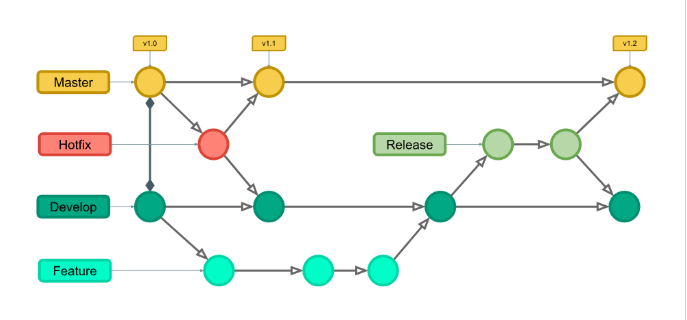

# EMV PASS - Transaction Service

<p align="center">
  <a href="https://skillicons.dev">
    
  </a>
</p>

Esta é uma aplicação desenvolvida em **NodeJS** e **Typescript**, responsável pela execução de transações **1TAP** no fluxo de **Transações EMV** da **Prodata Mobility Brasil**.

Em Resumo, a aplicação é integrada a um sistema de filas RabbitMQ para consumir as mensagens disponibilizadas em sua fila, mensagens que são as transações 1TAP que devem ter sua cobrança efetuada.

Tais transações são armazenadas em bancos de dados, inicialmente no MongoDB e posteriormente no OracleDB.

Para a efetivação das transações o serviço utiliza recursos da Cielo, consumindo sua API de E-Commerce.

Para o desenvolvimento utilizamos a versão estável mais atual do NodeJS **23.7.0**.
Utilizamos recursos externos como as **libs ou drivers** dos nossos **bancos de dados e fila**, e o restante das funcionalidades da aplicação utilizamos **recursos nativos**.

Tal aplicação possuí **testes automatizados** utilizando **Jest**.

<details>
    <summary>Clonagem de repositório e preparação de embiente de desenvolvimento</summary>

### Tutorial
- Instale o [NVM](https://www.digitalocean.com/community/tutorials/how-to-install-node-js-on-ubuntu-22-04) (Node Version Manager) que é o gerênciador de versões do NodeJS.
- Instale a versão mais atual do NodeJS:
```shell
npm install --lts
```
- Clone o repositório:
```shell
git clone git@github.com:prodatamobilitybrasil/pmb.abt.EMVPass.transactionService.git
```
- Instale as dependencias:
```shell
npm install
```

- Atualize as variáveis de ambiente em seu arquivo .env com as variáveis de ambiente de desenvolvimento:
```shell
ENVIRONMENT="DEV"

# Mongo DB Credentials
MONGO_CONN_STR="mongodb://172.24.11.73:27017/LOCAL_ABT"
MONGO_DB_NAME="LOCAL_EMV"

# Oracle DB Credentials
ORACLE_USER="ABT_GOIANIA_DESENV"
ORACLE_PASSWORD="DSVG0IANIA6E"
ORACLE_CONN_STR="(DESCRIPTION=(ADDRESS=(PROTOCOL=TCP)(HOST=172.17.10.36)(PORT=1522))(CONNECT_DATA=(SERVER=DEDICATED)(SERVICE_NAME=netunoora19)))"

# RabbitMQ Credentials
RABBIT_MQ_USER="emv_pass_dev_user"
RABBIT_MQ_PASSWORD="Prod@ta25"
RABBIT_MQ_HOSTNAME="172.17.11.100"
RABBIT_MQ_PORT="5672"
RABBIT_MQ_VHOST="emv_pass_dev"
RABBIT_MQ_QUEUE_CONSUMER="transaction_emv"
RABBIT_MQ_QUEUE_PRODUCER="retry_emv"

# Cielo API Config
CIELO_PHYSICAL_SALES="https://apisandbox.cieloecommerce.cielo.com.br/1/physicalSales"
CIELO_AUTH_TOKEN="https://authsandbox.cieloecommerce.cielo.com.br/oauth2/token"
CIELO_QUERY="https://apiquerysandbox.cieloecommerce.cielo.com.br/1/physicalSales"

CIELO_CLIENT_ID="26fac498-0460-4442-82c6-27d5aae3d61f"
CIELO_CLIENT_SECRET="1jU3CmDUx4QqcRpvgNcJiYkWUsQbGbeZOYS1P00O1uI="
CIELO_GRANT_TYPE="client_credentials"
```
**OBS:** Para execução da aplicação é necessário estar conectado a rede interna da Prodata seja presencialmente ou através de VPN.
- Teste sua aplicação:
```shell
npm test
```

- Execute em ambiente de desenvolvimento:
```shell
npm run dev
```
</details>

<details>
  <summary>Controle de versão com Git Flow</summary>
O Git Flow é um modelo, uma estratégia ou, ainda, um fluxo de trabalho muito utilizado por equipes de desenvolvimento de software. Ele se destaca por auxiliar na organização do versionamento de códigos.

O Git Flow trabalha com duas branches principais, a Develop e a Master, que duram para sempre; e três branches de suporte, Feature, Release e Hotfix, que são temporários e duram até realizar o merge com as branches principais.

Então, ao invés de uma única branch Master, esse fluxo de trabalho utiliza duas branches principais para registrar o histórico do projeto. A branch Master armazena o histórico do lançamento oficial, e a branch Develop serve como uma ramificação de integração para recursos.

É ideal que todos os commits na branch Master sejam marcados com um número de versão. Na imagem abaixo, vemos como é a estrutura do fluxo do Git Flow:



</details>

<details>
  <summary>Padrões de Commit</summary>

Para convenção de commit utilizamos padrões na mensagem de texto, onde cada comentário deve estar dentro do esperado senão, o commit não será realizado.
- **FEAT**: para adicionar funcionalidades.
```sh
git commit -m "feat: descrição breve sobre a feature desenvolvida"
```
- **FIX**: para adicionar correções de bugs.
```sh
git commit -m "fix: descrição breve sobre a correção implementada"
```
- **CHORE**: para atualização de dependências.
```sh
git commit -m "chore: descrição breve sobre a atualização realizada"
```
- **DOCS**: para adicionar ou alterar documentação ao projeto.
```sh
git commit -m "docs: descrição breve sobre a documentação adicionada"
```
- **TEST**: para adicionar testes a aplicação.
```sh
git commit -m "test: descrição breve sobre os testes implementados"
```
</details>

<details>
  <summary>Versionamento Semântico</summary>
O versionamento semântico se baseia em documentar a versão da aplicação com base no amadurecimento da mesma. Utilizamos três casas numéricas separadas por um ponto, onde cada casa tem sua função e demonstra diferentes contextos onde a aplicação evoluiu, vamos exemplificar com o valor 1.0.0:

- **Major (1)**: adicionamos +1 para quando temos uma quantidade grande de funcionalidades e ou de comportamentos novos ou diferentes da versão anterior.
- **Minor (primeiro zero)**: adicionamos +1 para cada funcionalidade adicionada, zerada quando o Major subir.
- **Patch (segundo zero)**: adicionamos +1 para cada uma das pequenas alterações, como correção de bugs, documentações e testes, sendo zerada quando o Major subir.
</details>

