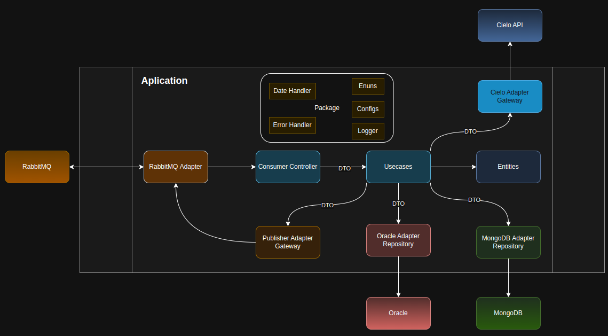

# EMV PASS - Transaction Service

<p align="center">
  <a href="https://skillicons.dev">
    
  </a>
</p>

Esta é uma aplicação desenvolvida em **NodeJS** e **Typescript**, responsável pela execução de transações **1TAP** no fluxo de **Transações EMV** da **Prodata Mobility Brasil**.

Em Resumo, a aplicação é integrada a um sistema de filas RabbitMQ para consumir as mensagens disponibilizadas em sua fila, mensagens que são as transações 1TAP que devem ter sua cobrança efetuada.

Tais transações são armazenadas em bancos de dados, inicialmente no MongoDB e posteriormente no OracleDB.

Para a efetivação das transações o serviço utiliza recursos da Cielo, consumindo sua API de E-Commerce.

Para o desenvolvimento utilizamos a versão estável mais atual do NodeJS **23.7.0**.
Utilizamos recursos externos como as **libs ou drivers** dos nossos **bancos de dados e fila**, e o restante das funcionalidades da aplicação utilizamos **recursos nativos**.

Tal aplicação possuí **testes automatizados** utilizando **Jest**.

<details>
    <summary>Clonagem de repositório e preparação de embiente de desenvolvimento</summary>

### Tutorial
- Instale o [NVM](https://www.digitalocean.com/community/tutorials/how-to-install-node-js-on-ubuntu-22-04) (Node Version Manager) que é o gerênciador de versões do NodeJS.
- Instale a versão mais atual do NodeJS:
```shell
npm install --lts
```
- Clone o repositório:
```shell
git clone git@github.com:prodatamobilitybrasil/pmb.abt.EMVPass.transactionService.git
```
- Instale as dependencias:
```shell
npm install
```

- Atualize as variáveis de ambiente em seu arquivo .env com as variáveis de ambiente de desenvolvimento:
```shell
ENVIRONMENT="DEV"

# Mongo DB Credentials
MONGO_CONN_STR="mongodb://172.24.11.73:27017/LOCAL_ABT"
MONGO_DB_NAME="LOCAL_EMV"

# Oracle DB Credentials
ORACLE_USER="ABT_GOIANIA_DESENV"
ORACLE_PASSWORD="DSVG0IANIA6E"
ORACLE_CONN_STR="(DESCRIPTION=(ADDRESS=(PROTOCOL=TCP)(HOST=172.17.10.36)(PORT=1522))(CONNECT_DATA=(SERVER=DEDICATED)(SERVICE_NAME=netunoora19)))"

# RabbitMQ Credentials
RABBIT_MQ_USER="emv_pass_dev_user"
RABBIT_MQ_PASSWORD="Prod@ta25"
RABBIT_MQ_HOSTNAME="172.17.11.100"
RABBIT_MQ_PORT="5672"
RABBIT_MQ_VHOST="emv_pass_dev"
RABBIT_MQ_QUEUE_CONSUMER="transaction_emv"
RABBIT_MQ_QUEUE_PRODUCER="retry_emv"

# Cielo API Config
CIELO_PHYSICAL_SALES="https://apisandbox.cieloecommerce.cielo.com.br/1/physicalSales"
CIELO_AUTH_TOKEN="https://authsandbox.cieloecommerce.cielo.com.br/oauth2/token"
CIELO_QUERY="https://apiquerysandbox.cieloecommerce.cielo.com.br/1/physicalSales"

CIELO_CLIENT_ID="26fac498-0460-4442-82c6-27d5aae3d61f"
CIELO_CLIENT_SECRET="1jU3CmDUx4QqcRpvgNcJiYkWUsQbGbeZOYS1P00O1uI="
CIELO_GRANT_TYPE="client_credentials"
```
- Teste sua aplicação:
```shell
npm test
```

- Execute em ambiente de desenvolvimento:
```shell
npm run dev
```
</details>

